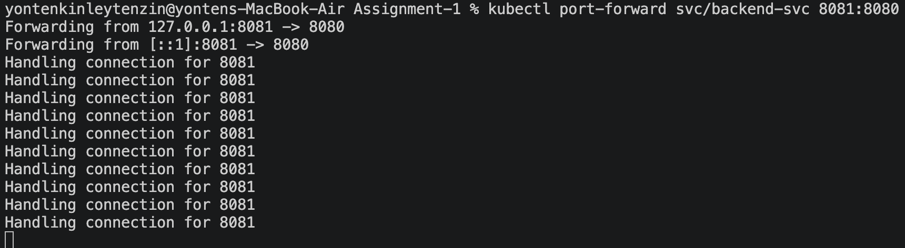

# DSO202 Assignment 1: Three-Tier Application Deployment on Kubernetes Cluster

### Task 1: Architecture Note
This deployment runs on the multi-node kind cluster from Practical 1 (1 control-plane, 2 worker nodes). When I apply a manifest with kubectl, the API server validates it and stores the resulting state in etcd. The scheduler then picks a node control-plane, worker-node-1, or worker-node-2 to run each Pod on, based on available resources.

On whichever node a Pod lands, kubelet pulls the image (sarojsanyasi/dso202-frontend:1.0, -backend:1.0, -db:1.0) and manages that Pod's lifecycle. kube-proxy sets up the networking rules that let Services route traffic to the right Pods. If a Pod dies, the controller-manager detects the mismatch between desired and actual state and creates a replacement this is the self-healing behaviour.

**Object Choice:**
- Deployments: all three tiers use a Deployment so they self-heal rather than running as bare Pods.

- PersistentVolumeClaim (PVC): The database uses PVC so its data isn't lost if the Pod restarts.

- Services: The database uses a headless Service (clusterIP: None) so it can be accessed inside the cluster using DNS. The backend uses a ClusterIP Service to keep the API internal. The frontend uses a NodePort Service so it can be accessed from a browser.

### Task 2: Configuration and Secrets
The `dso202-secret` stores the database credentials as base64-encoded values. I confirmed this by decoding `DB_PASSWORD` using `kubectl`, which showed the actual password.

However, base64 is **not encryption** and can easily be decoded. In a real production system, I would use **encryption at rest** or an external KMS to better protect the secrets.

The `DB_*` variables are used by the backend, while `POSTGRES_*` variables are used by the PostgreSQL image. Both use the same values so the backend can successfully connect to the database.

### Task 6: Namespace Resource Governance

The ResourceQuota and LimitRange were applied to the dso202-assignment-01 namespace. The quota shows 3 Pods using 300m CPU and 384Mi memory in requests exactly 3 × the LimitRange's defaults (100m CPU / 128Mi memory each) confirming the LimitRange is actively applied to every container automatically, not just declared and ignored.

Justification for chosen values: pods: 6 was chosen so a rolling update (old Pod + new Pod briefly running together) won't hit the limit. The per-container defaults are kept small on purpose, since this app is a simple CRUD demo rather than a production workload, and the cluster only has 3 nodes to work with.

### Task 7: Verification and Interactivity
#### 7A: Full CRUD cycle
I have used Postman to hit the backend directly through a port-forwarded connection, since the browser UI can't resolve the cluster-internal `backend-svc` DNS name.

firstly started port-forwarding the backend to localhost so Postman can reach it.

##### Create (POST)
I sent a POST request to create a new task. The response returned the task with a generated `id`. 

##### List (GET)
Then i fetched all tasks. the newly created task appears in the list

##### Update (PUT)
I updated the task's status to `done` using its `id` the response confirms the change.

##### Delete (DELETE)
Then I deleted the task by `id` 

#### 7B: Service DNS resolution 

Ran curl from inside the frontend Pod, targeting the backend by its Service name (`backend-svc`) instead of an IP. It resolved to `10.96.84.16` and returned `200 OK` with `{"status":"ok","db":"connected"}` 
which proof that Kubernetes' internal DNS is correctly routing requests to the backend Pod purely from the Service name.

#### 7C: Self-healing and data persistence
Manually deleted the running backend Pod to trigger self-healing.

Watched the Pods live during recreation:

**observation:**
After deleting the Pod, the old one (`w4snb`) terminated, and a completely new Pod (`zn65v` different name) was created automatically by the Deployment controller, reaching `Running` within seconds with no manual action taken. This confirms Kubernetes' self-healing behaviour.

To confirm data persistence, I fetched a task (id 2) that had been created earlier, through the newly recreated backend Pod:

**Observation:**
The task was still present with its original data intact, even though the backend Pod serving it was brand new. This confirms the database's data persisted on a PersistentVolumeClaim is completely independent of the backend Pod's own lifecycle.

#### 7D: Declarative vs imperative comparison

**Declarative:** created via `kubectl apply -f frontend/service.yaml`:

**Imperative:** created via `kubectl expose`:

| Method | NodePort | Speed | Configuration | Repeatability | Best Use |
|---|---:|---|---|---|---|
| Declarative (`kubectl apply`) | 30081 | Slightly slower | Defined in YAML | Easy to repeat and track | Final deployment |
| Imperative (`kubectl expose`) | 31225 | Quick | Created directly by command | Less predictable | Quick testing |

