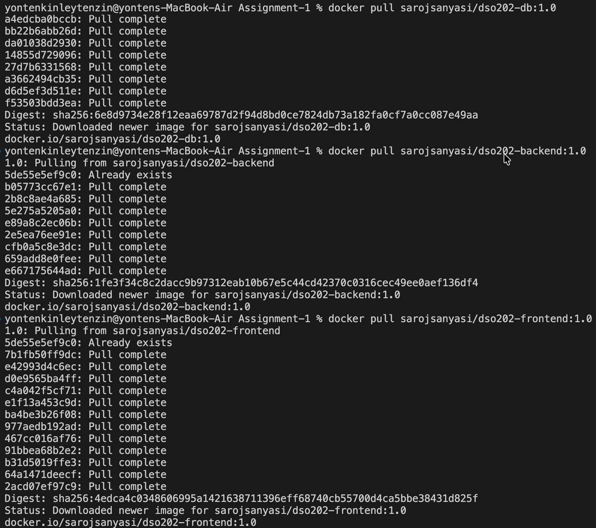
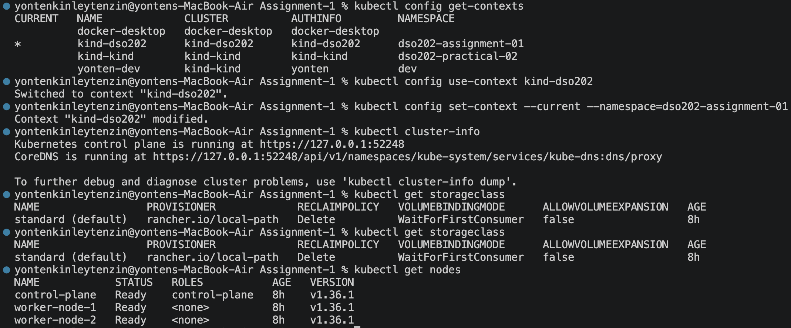
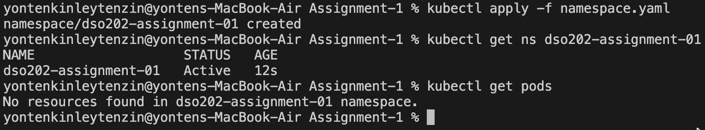
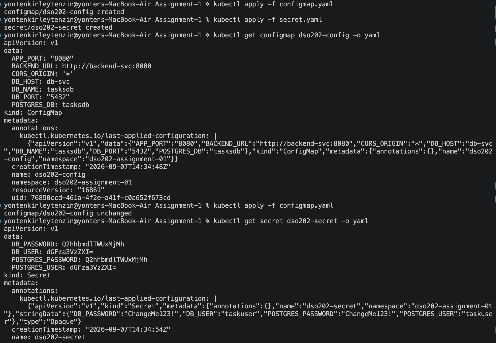

### Image pulling 
Pulled docker images from tutor's docker hub 

### Setup Practical 1 cluster
Firstly, i confirmed the kind-dso202 cluster from Practical 1 is running and set it as the active context, with dso202-assignment-01 as the default namespace. 

Then I verified the cluster has 3 nodes (1 control-plane, 2 workers) and a default standard StorageClass using the local-path provisioner with WaitForFirstConsumer binding mode meaning any PVC I create will stay Pending until a Pod that mounts it is scheduled, not until it's simply created.

### Task 1: Namespace and Architecture Note (maps 1.1, 1.5.1)

The namespace was created successfully and is Active. kubectl get pods confirms it is currently empty and that my kubectl context correctly defaults to this namespace, without needing -n on every command.

### Task 2: ConfigMap + Secret

