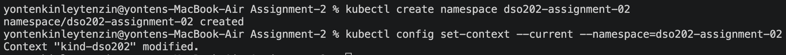
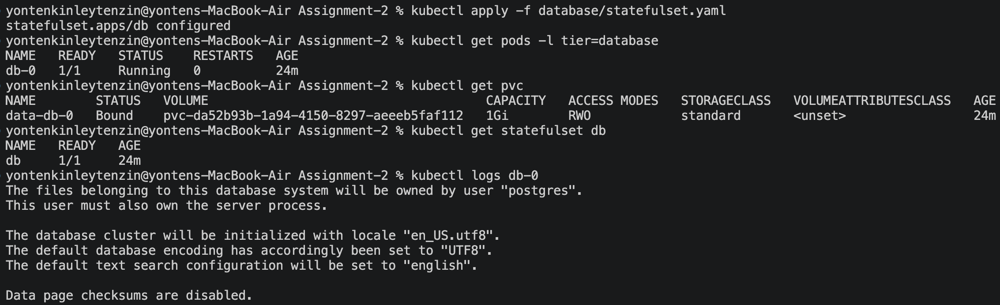
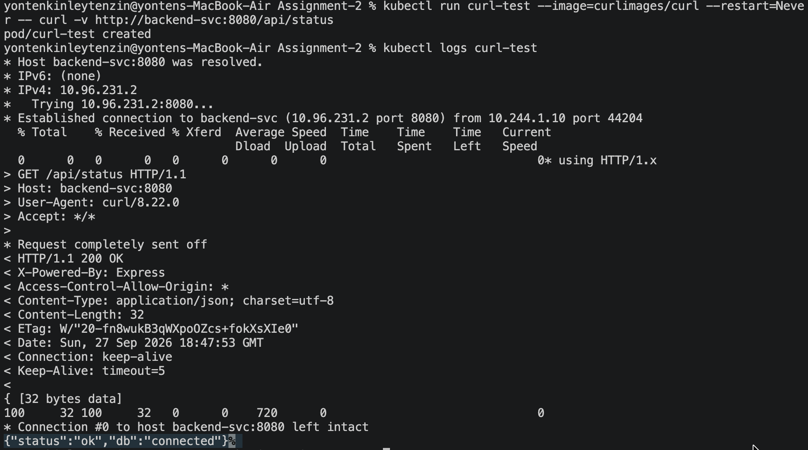
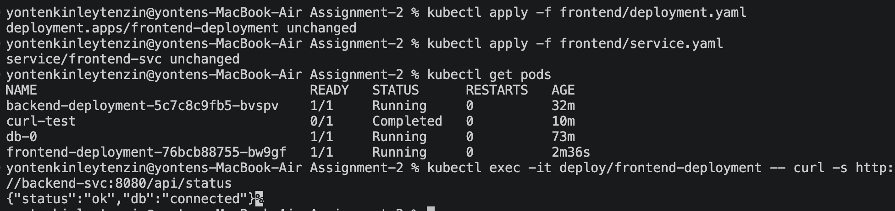
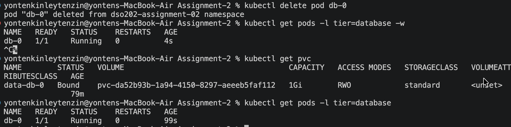

# DSO202 Assignment 2

1. created namespace



2. applied the statefulset and verified 


3. the backend to database connection is working 


we have confirmed with 
```
{"status":"ok","db":"connected"}
```

4. applied the frontend deployment  and service yaml files and here i have changed the nodeport to 30082.


5. Confirm stable identity survives a restart



- The database pod db-0 was deleted and automatically recreated by the StatefulSet. The pod returned to Running state with the same name, and the PVC data-db-0 remained Bound. This confirms that the stable identity and persistent storage were maintained after the restart.

6. 