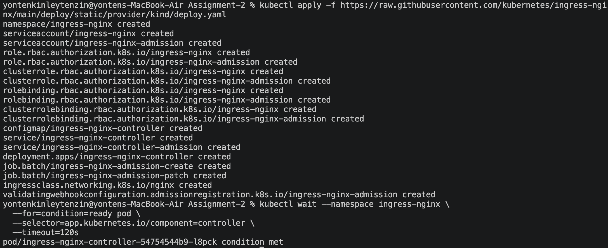
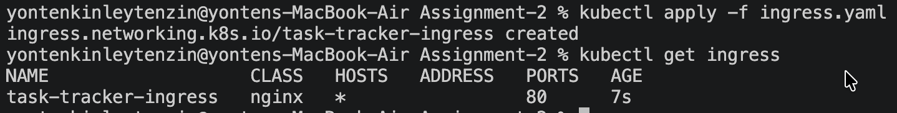
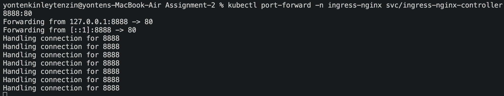
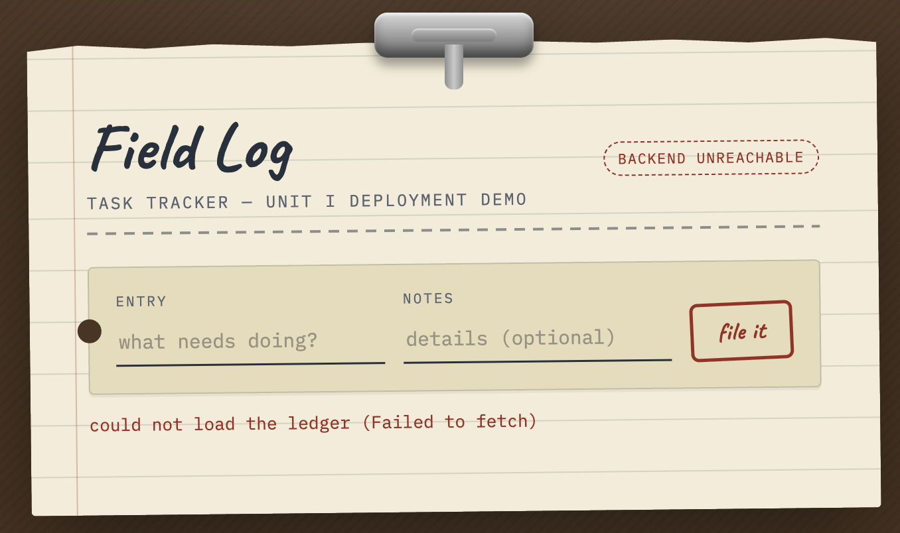
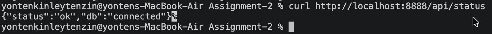

# DSO202 Assignment 2

## Overview

In Assignment 1 I deployed a three-tier Task Tracker (frontend, backend, database) on a local kind cluster. For Assignment 2, I applied Unit II concepts to that project:

StatefulSet: the database now runs as a StatefulSet instead of a Deployment.
Ingress: an Ingress and an NGINX Ingress Controller now route traffic to the frontend and backend through one entry point.

#### Changes made 

| Part | Assignment 1 | Assignment 2 |
|---|---|---|
| Database workload | Deployment (`db-deployment`) | StatefulSet (`db`) |
| Database storage | Standalone PVC (`db-pvc`) | PVC generated from `volumeClaimTemplates` (`data-db-0`) |
| Database Service | Headless `db-svc` | Kept as is, now used as the `serviceName` of the StatefulSet |
| External access | NodePort only | Ingress (`/` and `/api`) |
| Namespace | `dso202-assignment-01` | `dso202-assignment-02` |


## 1. Namespace

A separate namespace, dso202-assignment-02, was created for Assignment 2. This keeps the resources for this assignment separate from the previous assignment.


## 2. StatefulSet
### 2.1 Applying the StatefulSet


The database StatefulSet was applied successfully. The database pod db-0 was created and reached the Running state. A PersistentVolumeClaim (data-db-0) was also created and successfully bound to persistent storage.

### 2.2 Backend and Database Connection


The backend was tested through the /api/status endpoint. The following response was returned:
```
{"status":"ok","db":"connected"}
```

This confirms that the backend was able to connect successfully to the PostgreSQL database.

### 2.3 Frontend Deployment and Service

The frontend Deployment and Service were applied successfully. The NodePort was changed from 30081 to 30082 because port 30081 was already being used by the frontend service from Assignment 1 on the same Kubernetes cluster.


### 2.4 Stable Identity After Restart


The database pod db-0 was deleted and automatically recreated by the StatefulSet. The pod returned to Running state with the same name, and the PVC data-db-0 remained Bound. This confirms that the stable identity and persistent storage were maintained after the restart.

## 3. Ingress

### 3.1 Installing Ingress-NGINX


The Ingress-NGINX controller was installed for the kind Kubernetes cluster. This provides an Ingress controller for handling external HTTP requests and routing them to the required services.

### 3.2 Applying the Ingress Configuration


The ingress.yaml configuration was applied successfully. The Ingress was configured to route requests to the frontend and backend services.

### 3.3 Port Forwarding


- The Task Tracker frontend was successfully accessed through the Ingress at `http://localhost:8888/`, confirming that requests were routed to the frontend service.

### 3.4 Frontend Through Ingress
The Task Tracker frontend was successfully accessed through the Ingress at http://localhost:8888/, confirming that requests were routed to the frontend service.


### 3.5 Backend Status Through Ingress


The `/api/status` endpoint returned `{"status":"ok","db":"connected"}`, confirming that the Ingress successfully routed the request to the backend and that the backend was connected to the database.


## 4. Analysis
The StatefulSet gave the database pod a stable identity and enabled persistent storage with the PVC. The Kubernetes recreated the pod with the same identity after the deletion of db-0 and reattached the persistent volume.

The backend was also successfully connected to the database, as shown by the /api/status response.

Ingress was then configured to provide access to the application without directly exposing the backend service. Requests to  `/` were routed to the frontend service, while requests to `/api` were routed to the backend service.

The successful /api/status response through Ingress also showed that the request reached the backend and that the backend could still communicate with the database.

## 5. Conclusion
The StatefulSet and Ingress configurations were implemented and verified successfully. After restarting, the database preserved its identity and persistent storage and the backend established the connection with the database.

The Ingress Controller worked properly in routing the requests to both the frontend and backend services. To sum up, the operation of the critical components in Kubernetes used in this part of the work proved to be consistent with the expectations.