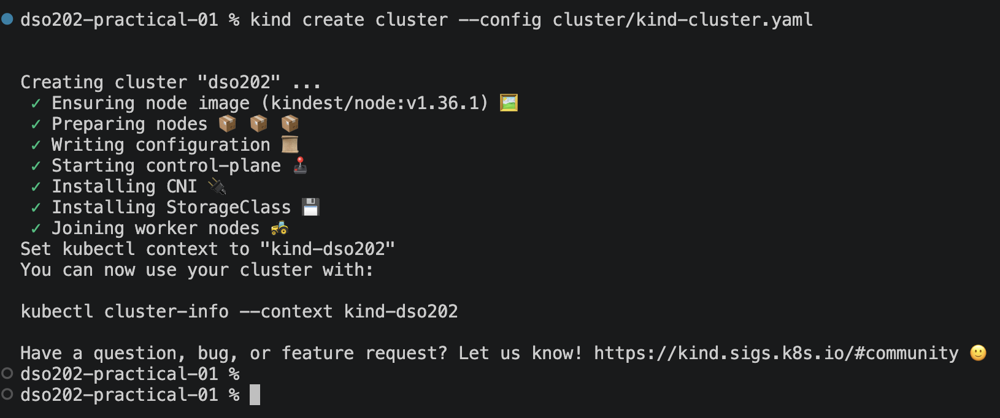

# Practical 1

## Objective 
This practical involved setting up a three-node Kubernetes cluster using kind and exploring key Kubernetes objects: Namespaces, Pods, Deployments, and Services using Nginx as the test workload.

The practical covered inspecting cluster components, applying resource limits, creating Pods, and using Deployments for self-healing, scaling, rolling updates, and rollback. ClusterIP and NodePort Services were also used to expose the application, while LoadBalancer limitations in kind were observed. All cluster operations were performed using kubectl.

# Procedure and Observations 
## Stage 1 - Creating the Three-Node Cluster


```bash
kind create cluster --config cluster/kind-cluster.yaml
```




The cluster came up successfully, pulling the image and starting the control plane, CNI, and StorageClass before joining the two worker nodes.


`docker ps` confirms the three Kubernetes nodes are really just three Docker containers — dso202-control-plane, dso202-worker, and dso202-worker2 — all reported as running.


`kubectl config current-context` returns kind-dso202, confirming kind automatically pointed my kubeconfig at the new cluster without any manual switching.

## Stage 2 - Inspecting the Cluster and Its Components


`kubectl cluster-info` shows where the API server is actually listening.


`kubectl get nodes` lists the three nodes under the names set by the kind config (control-plane, worker-node-1, worker-node-2) rather than the Docker container names


Adding `-o wide` surfaces the internal IPs and container runtime (containerd) without needing to switch to full YAML output.


`kubectl describe node worker-node-1` shows the full picture: labels, capacity/allocatable resources, and any Pods currently placed on the node.


Rather than scrolling through the full describe output, a JSONPath query pulls just the labels directly.


Before creating anything of my own, kubectl get namespaces shows the five namespaces kind and Kubernetes create by default:  default, kube-system, kube-public, kube-node-lease, and local-path-storage.


The control-plane components (etcd, kube-apiserver, kube-controller-manager, kube-scheduler) all run as ordinary Pods in kube-system, alongside kube-proxy and kindnet, which each appear once per node.


kubectl logs isn't just for application containers. 
the same command reads the logs of any control-plane Pod, which is useful when something in the cluster itself misbehaves.


kubectl api-resources lists every object kind the cluster understands, split by whether it's namespaced or cluster-scoped.


## Stage 3 - Namespaces, Resource Quotas, and Limit Ranges

Apply the namespace

```bash
kubectl apply -f manifests/00-namespace.yaml
```

Set it as your default namespace

```bash
kubectl config set-context --current --namespace=dso202-practical-01
```

Apply the quota + limit rang

```bash
kubectl apply -f manifests/01-quota-and-limits.yaml
```

Check it landed correctly

```bash
kubectl get resourcequota,limitrange
```


The quota already shows count/configmaps: 1/10 before I created anything myself. every namespace gets a kube-root-ca.crt ConfigMap automatically, so the quota's "Used" column counts objects the cluster created too, not just mine.

## Stage 4 - Pods

A **Pod** is the smallest deployable unit in Kubernetes.

A pod can have multiple container which mainly shares:

- networking 
- storage  

### The imperative route

Create a Pod with one command, then inspect it.

```bash
kubectl run web-imperative \
  --image=nginx:1.30-alpine \
  --restart=Never \
  --port=80 \
  --labels='app=web,tier=frontend,managed-by=imperative'
```


Watch the Pod reach `Running`. Press `Ctrl+C` to stop watching.

```bash
kubectl get pod web-imperative --watch
```


Capture the imperative Pod as a manifest. This is the bridge between the two styles.

```bash
kubectl get pod web-imperative -o yaml > evidence/web-imperative-as-stored.yaml
```

Delete the imperative Pod.

```bash
kubectl delete pod web-imperative
```

### The declarative route

Apply your Pod manifest

```bash
kubectl apply -f manifests/02-pod-web.yaml
```

Apply it again (prove declarative idempotency)

```bash
kubectl apply -f manifests/02-pod-web.yaml
```

Confirm it's running and see which node it landed on

```bash
Step 3 — Confirm it's running and see which node it landed on
```

Confirm the resource requests/limits took effect from your manifest (not the LimitRange defaults this time)

```bash
kubectl get pod web-pod -o jsonpath='{.spec.containers[0].resources}'
echo
```

Look at the labels

```bash
kubectl get pods --show-labels
```


Read the Pod's event timeline (important for troubleshooting later)

```bash
kubectl describe pod web-pod
```


Display labels alongside the Pod list.


Select Pods by label rather than by name. This is how every controller and every Service finds its Pods.

```bash
kubectl get pods -l app=web
kubectl get pods -l tier=frontend,managed-by=declarative
kubectl get pods -l 'tier in (frontend,backend)'
kubectl get pods -l app!=web
```


Add and then remove a label at runtime. The trailing hyphen removes a label.

```bash
kubectl label pod web-pod environment=practical
kubectl get pods -l environment=practical
kubectl label pod web-pod environment-
```


Add an annotation and observe that it cannot be selected on.


### Debugging and troubleshooting commands

These four commands are descriptor section 1.3.3, and they are the most-used commands in the remainder of the module.

Read the container's log stream. `-f` follows it; `--tail` limits the history.

```bash
kubectl logs web-pod --tail=5
```


Open a shell inside the running container. Because `nginx:1.30-alpine` is Alpine-based, the shell is `sh`, not `bash`.


Run a single command inside the container without an interactive session


Forward a local port to the Pod. This opens a tunnel from the host, through the API server, to the Pod. It is intended for debugging, never for exposing an application.

```bash
kubectl port-forward pod/web-pod 8080:80
```


Use `kubectl explain` whenever a field is unfamiliar. It reads the schema from the live cluster, so its answer is always correct for the running version.


## Stage 5 - Deployments

**ReplicaSet.** A controller object holding a Pod template, a replica count, and a label selector. Its control loop counts the Pods matching its selector, creates more if there are too few, and deletes some if there are too many. ReplicaSets are rarely written by hand.

**Deployment.** A controller object that manages ReplicaSets. Changing a Deployment's Pod template causes it to create a **new** ReplicaSet and shift replicas from the old one to the new one gradually. The old ReplicaSet is kept, scaled to zero, so that a rollback is a matter of shifting replicas back

To create a deployment, we can use the following command:

```bash
kubectl create deployment -n <namespace-name> <deployment-name> --image=<image-name>
```

```bash
kubectl apply -f <manifests-file>
```


Observe the three-level ownership chain in the cluster.

```bash
kubectl get deployment,replicaset,pod -l app=web
```


Confirm the ownership relationship rather than inferring it from names.

```bash
kubectl get replicaset -l app=web -o jsonpath='{.items[0].metadata.ownerReferences[0].kind}/{.items[0].metadata.ownerReferences[0].name}{"\n"}'
```


Confirm the scheduler spread the replicas across the worker nodes.

```bash
kubectl get pods -l app=web -o wide --no-headers | awk '{print $1, $7}'
```


Demonstrate self-healing. Delete one Pod and immediately list them again.

```bash
victim=$(kubectl get pods -l app=web -o jsonpath='{.items[0].metadata.name}')
echo "deleting $victim"
kubectl delete pod "$victim"
kubectl get pods -l app=web
```


A replacement Pod appears within seconds, with a new random suffix but the same ReplicaSet prefix. Record the before-and-after listing in the report; this is the single clearest illustration of reconciliation in the practical.

```bash
kubectl get events --field-selector reason=SuccessfulCreate --sort-by=.lastTimestamp | tail -3
```


### Scaling

Scale imperatively, then read the result.

```bash
kubectl scale deployment web-deployment --replicas=5
kubectl get deployment web-deployment
```


Return to three replicas the declarative way, by re-applying the unmodified manifest.

```bash
kubectl apply -f manifests/06-deployment-web.yaml
kubectl get deployment web-deployment
```


### Rolling update and rollback

Watching the rollout in a second terminal, before triggering it.


Updating the image triggers a rolling update, with the change-cause annotation recording why the change was made:

```bash
kubectl set image deployment/web-deployment web=nginx:1.31-alpine
kubectl annotate deployment web-deployment \
  kubernetes.io/change-cause="upgrade nginx from 1.30-alpine to 1.31-alpine"
kubectl rollout status deployment/web-deployment
```


Confirm two ReplicaSets now exist, one of them scaled to zero.

```bash
kubectl get replicaset -l app=web
```


The old ReplicaSet is retained precisely so that a rollback needs no image pull and no new object.

Read the revision history &  Inspect one revision in detail.

```bash
kubectl rollout history deployment/web-deployment
kubectl rollout history deployment/web-deployment --revision=1 | grep -i image
```


 Roll back to the previous revision and confirm

```bash
kubectl rollout undo deployment/web-deployment
kubectl rollout status deployment/web-deployment
kubectl get deployment web-deployment -o jsonpath='{.spec.template.spec.containers[0].image}{"\n"}'
```


Demonstrate a failed rollout and recover from it. This is deliberate: a rollout that cannot succeed must be recognised quickly.

```bash
kubectl set image deployment/web-deployment web=nginx:9.99-does-not-exist
kubectl rollout status deployment/web-deployment --timeout=60s

kubectl get pods -l app=web
```


Note carefully what did **not** happen: the three healthy Pods were never removed. Because `maxUnavailable: 0` and the new Pod never became ready, the rolling update stalled without causing an outage. A correctly configured rollout strategy converts a bad release into a stalled release rather than a failure.

Diagnose and undo.


Restore the declared state, so that the repository and the cluster agree again.


## Stage 6 - Services

A **Service** gives a stable virtual IP and DNS name that stays constant even as the Pods behind it come and go. Under the hood, the EndpointSlice controller tracks which Pods currently match the Service's selector and are ready, kube-proxy uses that list to forward traffic on every node, and CoreDNS answers name lookups for the Service. A Service does not do application-layer routing, TLS termination, or retries, that's what an Ingress is for.

```bash
kubectl apply -f manifests/04-service-clusterip.yaml
kubectl get service web-clusterip
kubectl get endpointslice -l kubernetes.io/service-name=web-clusterip
```


Applying a client Pod (manifests/06-pod-client.yaml) that exists purely to test the Service from inside the cluster, then resolving the Service name and requesting through it:

```bash
kubectl wait --for=condition=Ready pod/client-pod --timeout=60s

kubectl exec client-pod -- nslookup web-clusterip
kubectl exec client-pod -- wget -qO- http://web-clusterip | head -4
```


### NodePort
Applying the NodePort Service, which fixes `nodePort: 30080`
the same host port published by the kind cluster config:

Reaching the application from the host machine directly, with no `port-forward` running:


Repeated requests return different Pod names, confirming the load-balancing across replicas.

Confirming the node port is open on every node, not just the one exposed to the host:

```bash
docker exec dso202-worker curl -s http://localhost:30080
```


Finally, creating a LoadBalancer Service to confirm it never leaves <pending> on kind, since there's no cloud provider to fulfil the request, this is expected behaviour.

```
kubectl create service loadbalancer lb-demo --tcp=80:80
kubectl get service lb-demo
kubectl delete service lb-demo
```


## Stage 7 - Cleanup

A kind cluster keeps consuming memory and disk until it's deleted, so this stage removes the workload and the cluster itself and, by rebuilding everything from the manifests in one command, proves the whole setup is reproducible from the repository alone rather than depending on anything specific to this laptop.

Capture final evidence before deleting anything.


Deleting the workload objects declaratively, from the same manifest files that created them, then confirming the namespace is clear of everything but the quota and limit range:

```bash
kubectl delete -f <filename>

## Confirm the namespace is empty apart from the quota and limit range
kubectl get all
```


Rebuilding everything from the repository in a single command, since `kubectl apply -f manifests/` applies files in lexical order, which is exactly why they're numbered:


Resetting the default namespace and deleting the cluster entirely:

```bash
kubectl config set-context --current --namespace=default
kind delete cluster --name dso202
kind get clusters
```


`kind get clusters` reports none remaining, and docker ps shows no kindest/node containers left running.

# Analysis
From this practical i learned that K8s is built around reconciling actual state with desired state. controllers continuously push the cluster toward whatever was declared, which is what makes self-healing, scaling, rolling updates, and Service routing all work the same underlying way.

In this practical I built a three-node cluster, applied namespace-level quotas and limits, created Pods both imperatively and declaratively, and used a Deployment to exercise self-healing, scaling, rolling updates, rollback, and failure recovery, then exposed the result through ClusterIP and NodePort Services. The cluster was torn down at the end, and rebuilding it from the repository's manifests alone confirmed the whole setup is reproducible.

# Reflection
The stage I found most challenging was Stage 5, especially the rolling update part. I ran into an error there when I deliberately set the Deployment's image to a tag that doesn't exist, just to see what would happen. The rollout got stuck, and one Pod stayed in ImagePullBackOff while the other three kept running fine. I used kubectl describe pod on the stuck one, and the Events: section told me straight away that the image couldn't be pulled. To fix it, I ran kubectl rollout undo, which brought the Deployment back to the last working version.

Doing this practical also helped me understand why K8s keeps the old ReplicaSet around after an update instead of deleting it, it's there so a rollback is quick and doesn't need a fresh image pull.

One thing I am still not fully clear on is why the namespaces don't isolate network traffic by default, a Pod in one namespace can still reach a Pod in another unless a NetworkPolicy blocks it, which felt like the opposite of what I expected a namespace to do.