# DSO202 Practical 02 Report: Kubernetes Storage and StatefulSets

## 1. Objective
This practical was about learning how Kubernetes handles data that actually needs to survive unlike Practical 1, where everything was disposable. I worked through PersistentVolumes, PersistentVolumeClaims, and StorageClasses to understand how storage is described and provisioned, then moved on to StatefulSets to see why a normal Deployment isn't good enough for something like a database. The practical builds up to deploying a real PostgreSQL database, writing data to it, deleting its Pod on purpose, and confirming the data was still there afterward.

## 2. Environment
- operating system: macOS 
- Docker Desktop Version: 28.3.2
- Kind Version: kind v0.32.0 go1.26.3 darwin/arm64
- Kubectl Client Version: v1.36.3
- Cluster Kubernetes Version: v1.36.1
- PostgreSQL Image: postgres:18-alpine

## 3. Procedure and Observations
### Stage 1 - Cluster, Namespace, and the Storage Landscape
#### 6.1 Created the cluster

Copied into cluster/kind-cluster.yaml, then created the cluster.
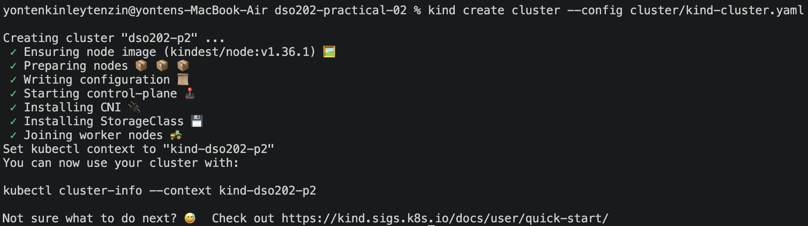

Confirmed the nodes and recorded the mapping between Node object names and Docker container names.
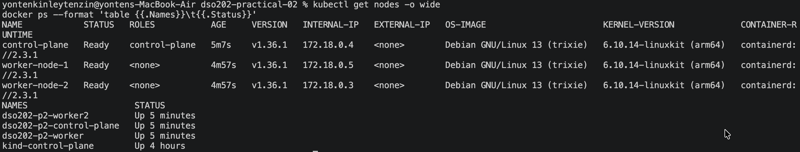

Verified that worker-node-1 successfully mounted the host directory.
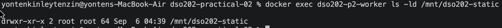

#### 6.2 Applied Namespace, Quota, and StorageClass.
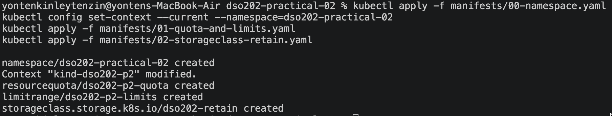
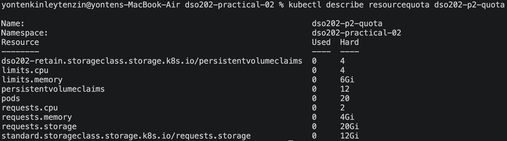

-  The resourcequota output confirmed a 10Gi cap on the standard StorageClass.

#### 6.3 Locate the provisioner
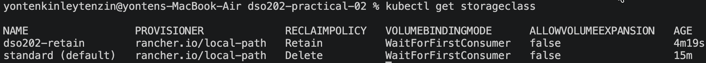

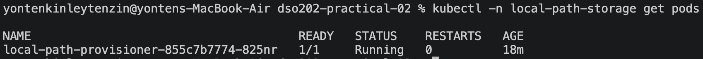

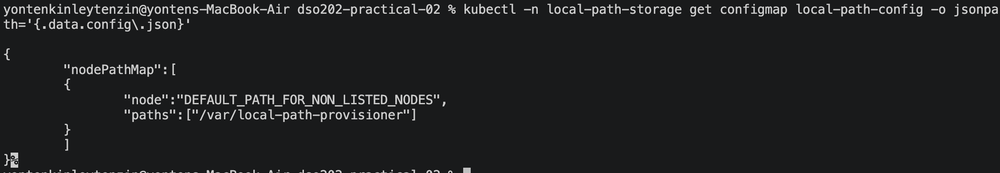

## Stage 2 — Static Provisioning, and the Meaning of Retain
#### Create the PersistentVolume
Step 1. Apply  5 and inspect the result.
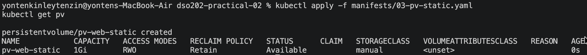

Step 2. Read the two fields that constrain scheduling.
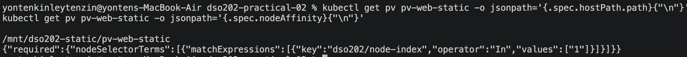

#### Claim it and write to it

Step 3. Apply  6 and observe immediate binding.
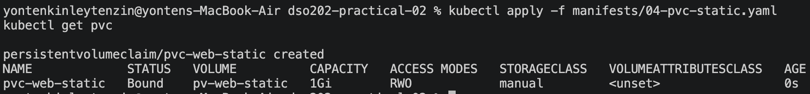

Step 4. Confirm the match rules by asking what the claim received.
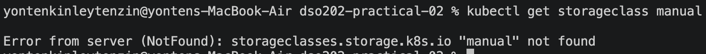

Step 5. Apply  7. The Pod appends one line to a file on the volume each time it starts.
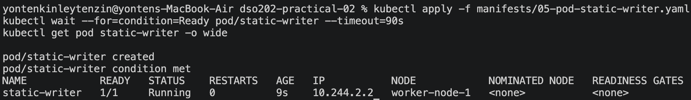

Step 6. Read the file from inside the container, then from the host.
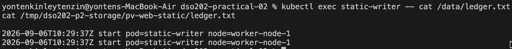

#### 7.3 Prove the volume outlives the Pod
Step 7. Delete the Pod, recreate it, and read the file again.
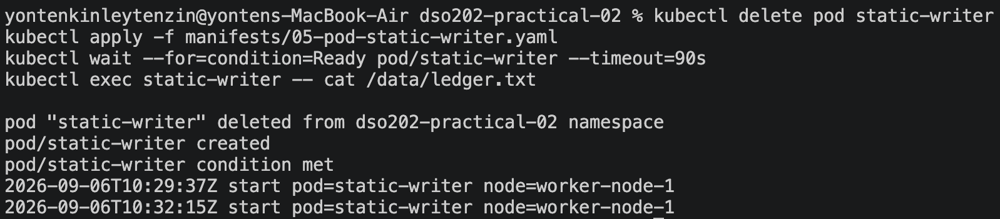

#### 7.4 Delete the claim and observe Released
Step 8. Delete the Pod and then the claim, and watch the phase of the PV.
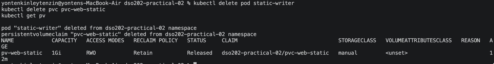

Step 9. Confirm that the data is untouched, then remove the PV object.
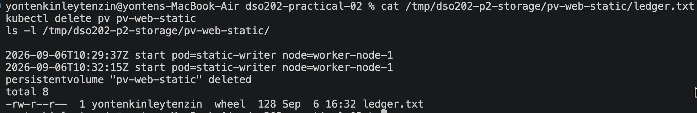

Step 10. Recreate all three objects and read the file one final time.
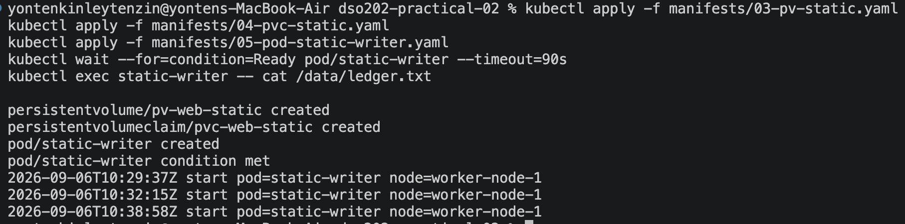

## Stage 3 — Dynamic Provisioning, StorageClasses, and Two Uncomfortable Truths

#### 8.1 A claim that will not bind
Applied dynamic PVC & observing Released phase
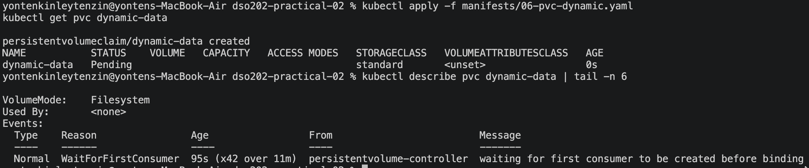

#### 8.2 Introduce a consumer
Apply  7 & Finding the volume on the node.
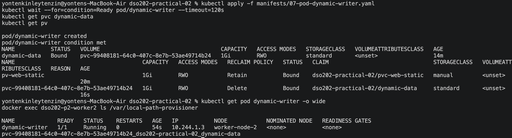

#### 8.3 First uncomfortable truth: the requested size is not a limit here
Step 5. Ask the container how large its 1Gi volume is.
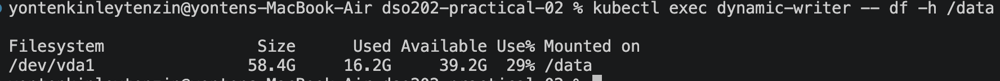

#### 8.4 Second uncomfortable truth: this volume cannot grow
```
kubectl patch pvc dynamic-data --type merge -p '{"spec":{"resources":{"requests":{"storage":"2Gi"}}}}'

Error from server (Forbidden): persistentvolumeclaims "dynamic-data" is forbidden: only dynamically provisioned pvc can be resized and the storageclass that provisions the pvc must support resize'
```
The rejection comes from the API server, not from the provisioner, and it is caused by allowVolumeExpansion: false on the class. The valuable part of this experiment is that the request failed loudly. A claim whose class permits expansion is grown by editing the same field, after which the volume and then the filesystem are resized. The choice of class is therefore a decision about the future of a workload, taken before any data exists, which is why 1.4.3 belongs in this practical rather than in a later one.

#### 8.5 Compare the two classes, then delete the claim
Step 7. Write to the volume, then delete Pod and claim, and observe what Delete means.
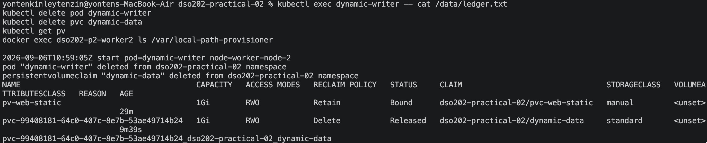

## Stage 4 — Why a Deployment Cannot Own State
Apply  8 
Read the file that all three replicas mounted
Delete one replica and observe the identity problem
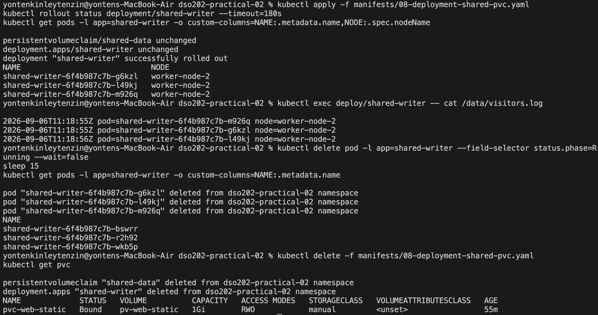

## Stage 5 — StatefulSets and Stable Identity
Apply Listing 11 before the StatefulSet.
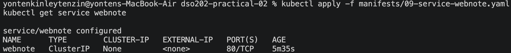

Apply Listing 12 and watch. The -w flag keeps the command running; interrupt it with Ctrl-C once three Pods are Running.
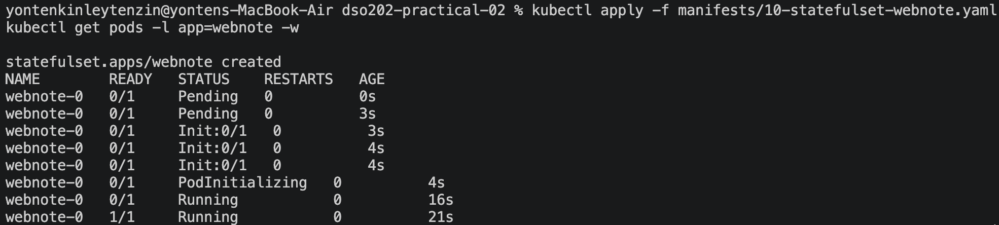

Inspect the claims the controller created.
Confirm that placement is now free, because each Pod has its own volume.
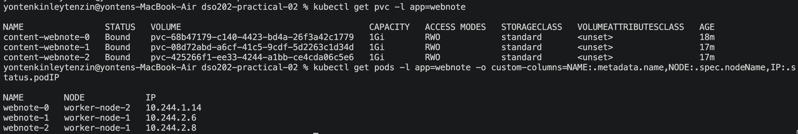

#### 10.3 Address individual Pods by name
Start the client Pod from Listing 13 and resolve both DNS forms.
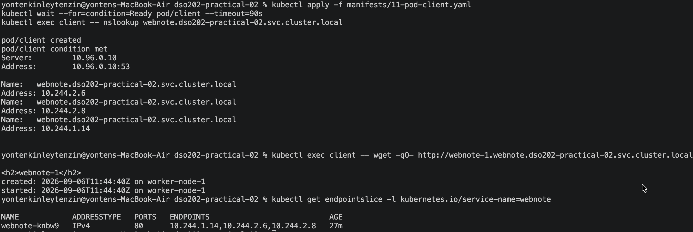

#### 10.4 Prove the volumes are private
Write a note into one Pod only, then read both Pods.
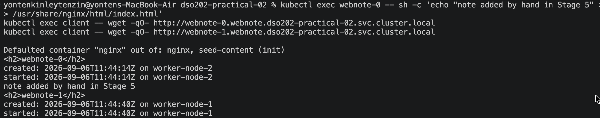

#### 10.5 Prove that identity and storage survive deletion
Step 9. Delete the middle Pod and watch the replacement.
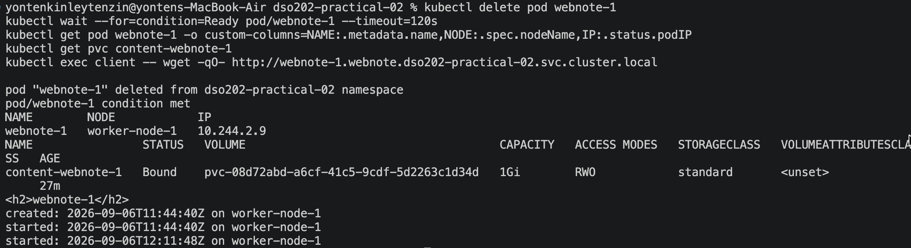

## Stage 6 — Scaling, Retention, and Ordered Updates
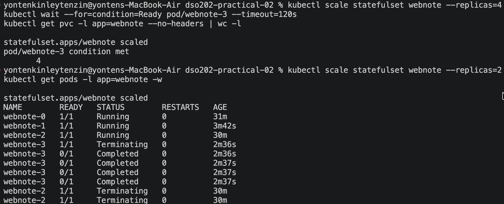

Count the claims again.
Scale back to three and read the returning replica.
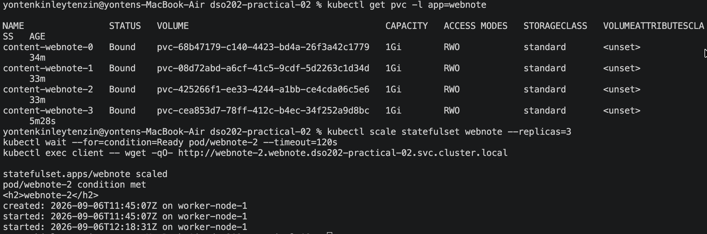

#### 11.3 A partitioned rolling update

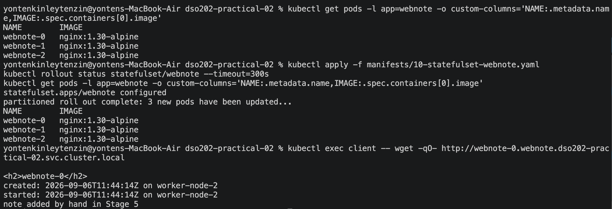

#### 11.4 Delete the controller, keep the data
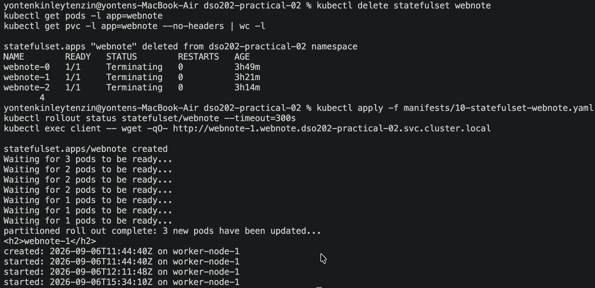

## Stage 7 — A Real Stateful Application: PostgreSQL
#### 12.1 Credentials and Services
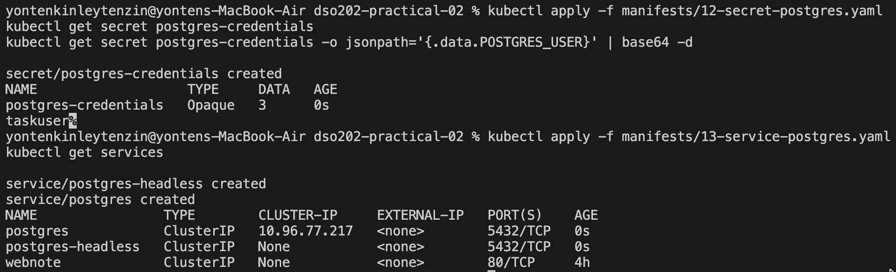

#### 12.2 Deploy the database
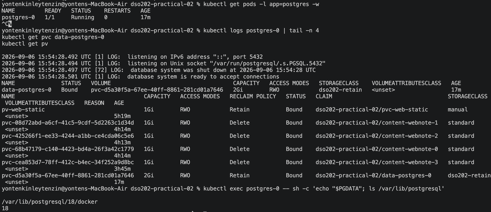

#### 12.3 Write data and destroy the Pod
Create a table and insert rows. The commands below connect over the container's local socket, which the official image trusts, so no password is needed inside the Pod.

Delete the database Pod. This is the test the whole practical has been building towards.

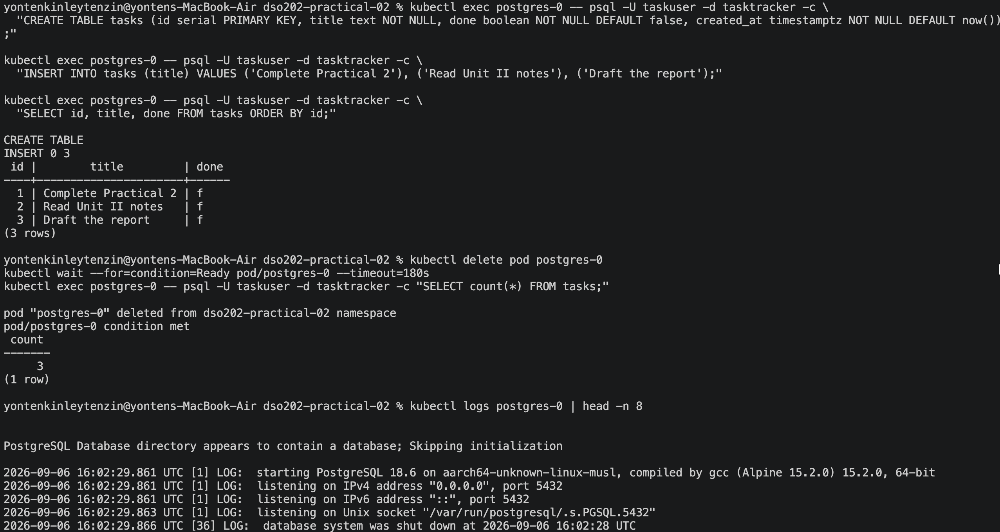

##  Stage 8 - Cleanup, and the Cost of Retain
Capture evidence before deleting anything.
Delete the workloads.
Inspect what survived, and note that no command so far has removed a single claim.

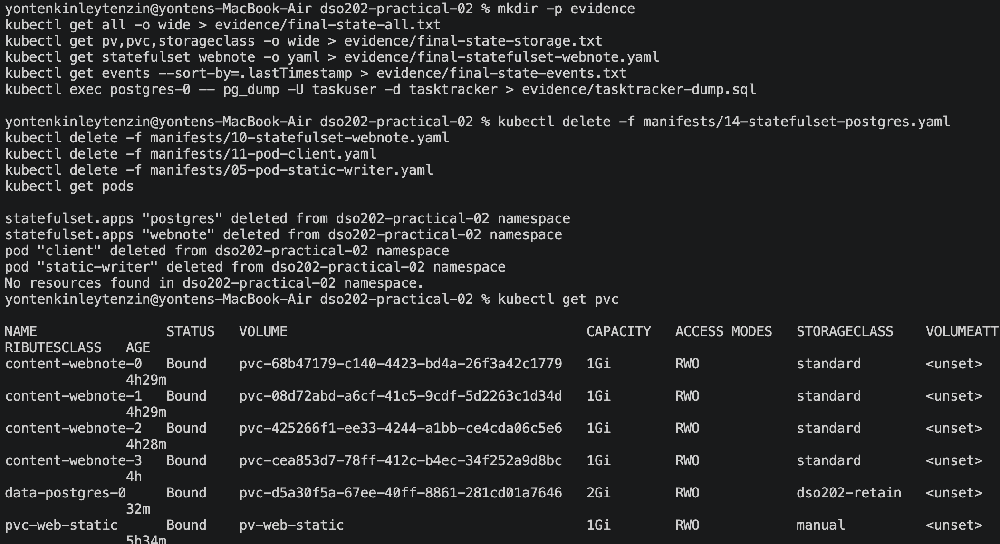


Delete the claims explicitly and watch the two reclaim policies diverge.
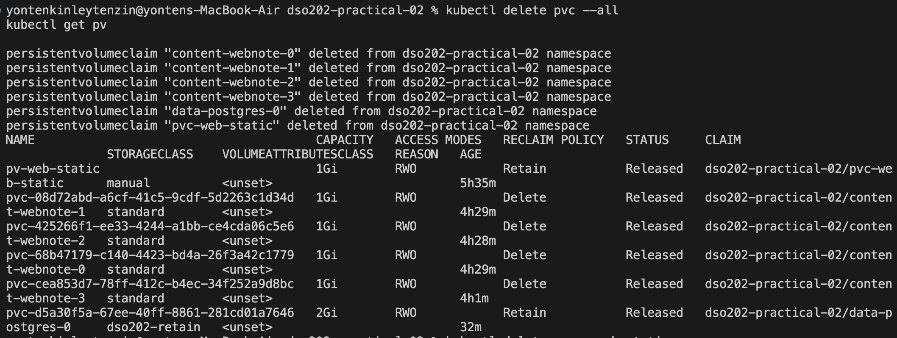

## Review Questions
1. The claim in Stage 3 was Pending immediately after creation, while the claim in Stage 2 bound at once. Name the single field responsible for the difference and explain the reasoning behind that field's design.

**Ans:** The field responsible was volumeBindingMode. In Stage 3, the StorageClass used WaitForFirstConsumer, so Kubernetes waited until a Pod was scheduled before deciding where to create/bind the volume. This avoids creating storage on a node where the Pod cannot run. Stage 2 used a manually created PV, so it could bind immediately

2. After the claim was deleted, the data from Stage 2 survived and the data from Stage 3 did not. State which object carried the field that decided this, and who in a real organisation would have chosen its value.

**Ans:** The deciding field was reclaimPolicy, which is part of the StorageClass/PersistentVolume configuration. Stage 2 used Retain, so deleting the claim left the storage and its data behind. Stage 3 used the default Delete policy, so the dynamically created storage was removed with the claim. In a real organisation, the value would normally be chosen by the cluster/storage administrator or platform team based on the workload's data-retention requirements

3. In Stage 4 all three replicas were scheduled onto one node although the Deployment expressed no node preference. Explain the mechanism, and state what would have happened instead on a managed cloud cluster using a zonal disk.

**Ans:** The local cluster's storage provisioner creates the volume as a directory on the node filesystem. Since ReadWriteOnce means the volume can be mounted by multiple Pods on the same node, Kubernetes was able to schedule all three replicas there.

On a managed cloud cluster using a zonal network disk, a replica scheduled to another node would normally fail to start because the disk is attached to another node, producing a multi-attach error.

4. Give the fully qualified DNS name of the second replica of the webnote StatefulSet, and name every object that must exist for it to resolve.

**Ans:** The second replica is webnote-1, its fully qualified DNS name is:

webnote-1.webnote.dso202-practical-02.svc.cluster.local

For this to resolve, the following must exist:

- The webnote-1 Pod
- The webnote StatefulSet
- The webnote headless Service with clusterIP: None
- The Service must be in the dso202-practical-02 namespace
- The StatefulSet's serviceName must be webnote

5. The StatefulSet was scaled from four replicas to two and back to three. Describe what happened to the claims at each step, name the two fields that governed it, and state their default values.

**Ans:** When the StatefulSet was scaled from 4 to 2, the Pods with higher ordinals were removed, but their PVCs were kept. When it was scaled back from 2 to 3, the missing Pod was recreated and its existing PVC was reused.

The two fields controlling this were:
- whenScaled
- whenDeleted

Both were set to Retain in the manifest, and both default to Retain.

6. Listing 16 mounts the volume at /var/lib/postgresql rather than at the data directory. Explain why, and describe the failure that mounting at the data directory would produce on a volume that is not empty.

**Ans:** PostgreSQL 18 stores its actual data directory inside a version-specific subdirectory under /var/lib/postgresql. Therefore, the practical mounts the volume at the parent directory so the PostgreSQL data directory is inside the volume.

If the volume were mounted directly at the data directory and already contained files created by the storage driver, PostgreSQL's initdb could fail because it expects the directory to be empty during initialization.

7. State two things a StatefulSet does not provide for a database, and name the Kubernetes mechanism or the software category that provides each in production.

**Ans:**
- **Data replication:** A StatefulSet does not copy data between replicas. Each replica has its own independent volume. Replication must be provided by the database/application itself, often with database-specific software or an Operator.

- **Backup:** A StatefulSet does not create backups.Production systems need a backup solution/tool to create separate recoverable copies of the database.


8. After the claims were deleted in Stage 8, two PersistentVolumes reported Released. Explain why the phase was not Available, and state what an administrator must do to return that storage to service.

**Ans:**
The two PVs were Released because their PVCs had been deleted while the PVs had a Retain reclaim policy. Kubernetes does not automatically make a released volume available to a new claim because it may still contain the previous workload's data.

To return the storage to service, an administrator must deliberately clean/recover the storage and recreate or reset the PV, depending on the storage backend. Simply deleting the PV object does not delete the actual data

## Reflection

The most difficult part of this practical was understanding the difference between PVs, PVCs, StorageClasses, and StatefulSets. I also found it confusing when a PVC stayed in `Pending` and how `WaitForFirstConsumer` works.

One error I faced was related to the PostgreSQL data directory. I diagnosed it using `kubectl logs postgres-0`, which helped to identify the problem with the mounted volume.

If I did the practical again, I would check the StorageClass, PVC, and PV configuration first. I would also use `kubectl describe`, `kubectl get`, and `kubectl logs` earlier to troubleshoot problems instead of guessing.

One thing that is still unclear to me is how the local storage used in the kind cluster would work in a real cloud Kubernetes environment.

Overall, this practical helped me better understand how StatefulSets provide stable Pods and persistent storage for stateful applications.

## References
1. Kubernetes Documentation, “StatefulSets.” https://kubernetes.io/docs/concepts/workloads/controllers/statefulset/?utm_source=chatgpt.com 
2. Kubernetes Documentation, “Persistent Volumes.” https://kubernetes.io/docs/concepts/storage/persistent-volumes/?utm_source=chatgpt.com 


