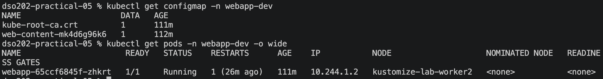
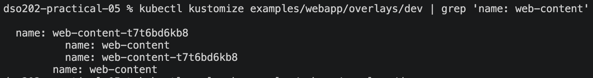
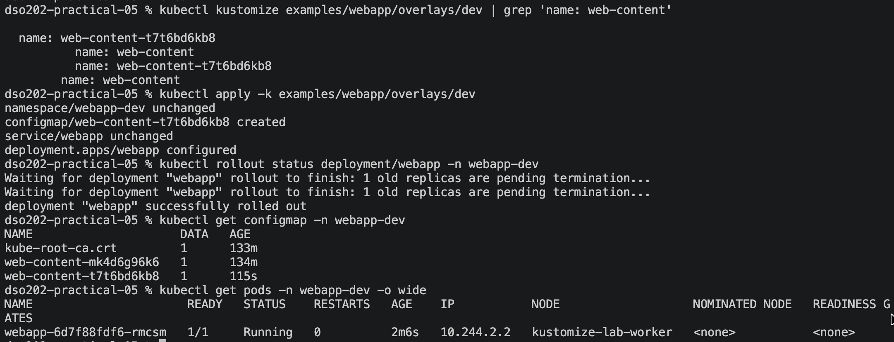
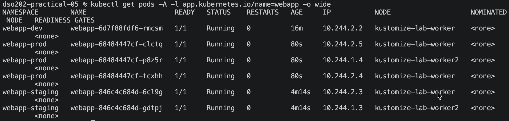
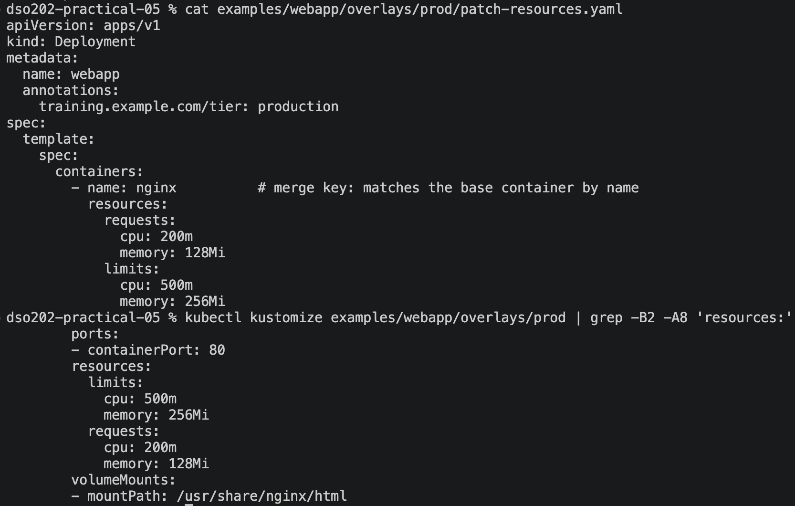
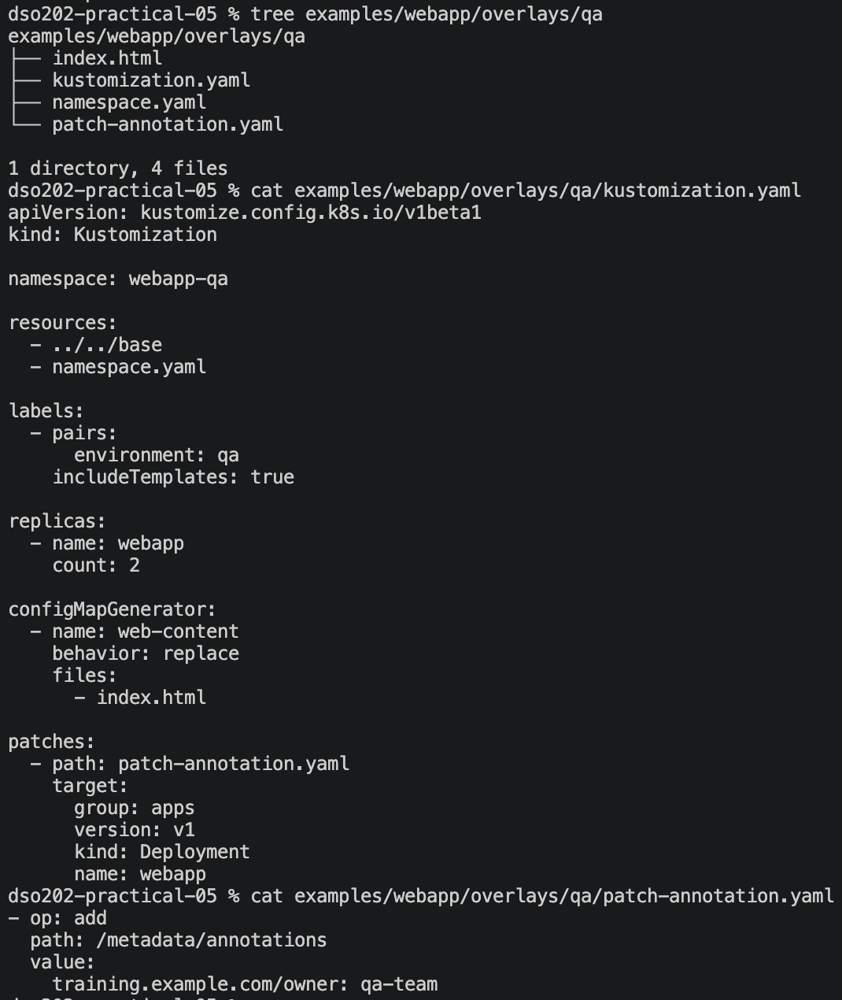
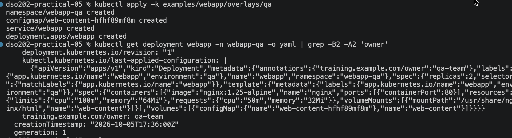
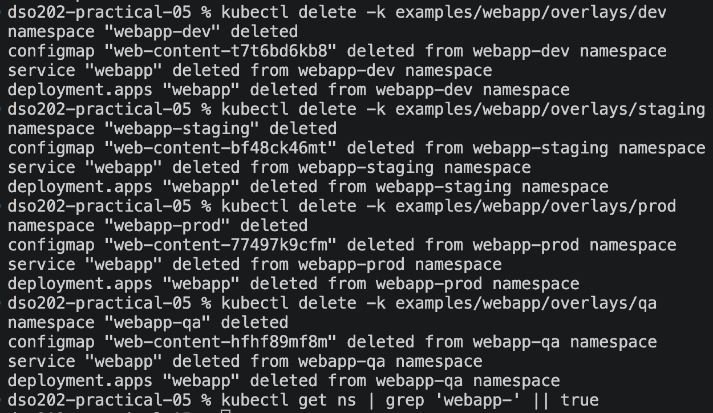

# Practical 5: Environment-Specific Configuration with Kustomize on Kind

## Objective

To use Kustomize to run one web application in dev, staging, prod and QA without copying the base manifests. I learned to:

- render a base and overlays and read the output;
- change namespace, labels, replicas and image tags per environment;
- use generators and patches;
- see how a ConfigMap hash triggers a rollout;
- follow the safe workflow: **render → diff → apply → verify**.

## Environment

| Item | Details |
|---|---|
| Cluster | Kind, 1 control-plane + 2 workers (Kubernetes v1.36.1) |
| kubectl | v1.36.3 (built-in Kustomize v5.8.1) |
| Machine | macOS (arm64) with Docker |
| App | NGINX serving a page from a generated ConfigMap |

**Layout:** one `base/` (Deployment, Service, `index.html`) and one overlay each for dev, staging, prod, qa and sandbox.

## Procedure and Observations
### Task 1: Read the repository before running it 

*The repository tree: one `base/` and an overlay folder per environment.*

*The base and dev `kustomization.yaml` files.*

1. Which files exist only once for all environments?

**Ans:** Files that exist once for all environments are deployment.yaml, service.yaml, index.html and kustomization.yaml, all in base/.

2. Which values differ between environments?

**Ans:** The values that differ between environments are namespace, environment label, replica count, image tag, page content, and (prod only) resource limits and an annotation.

3. Where are those differences represented?

**Ans:** They are represented in each overlay's kustomization.yaml (namespace, labels, replicas, images, generator) plus its own index.html, namespace.yaml and patch file.

### Task 2: Render the base 

*Rendering the base gives a ConfigMap, a Service and a Deployment.*

*The ConfigMap name has a hash, and the Deployment reference uses the same name.*

from the above command we got:

| Resource | Details |
|---|---|
| The Deployment | `kind: Deployment`, named `webapp` |
| The Service | `kind: Service`, named `webapp` |
| The generated ConfigMap | `kind: ConfigMap` with the content from `base/index.html` |
| The hash suffix | `web-content-97bftm2bkd` |
| The rewritten reference | Under `volumes:`, `configMap: name: web-content-97bftm2bkd` |

Explain why the generated ConfigMap name does not exactly equal web-content?

**Ans:** The generated ConfigMap name is `web-content-97bftm2bkd`, not `web-content`, because Kustomize's `configMapGenerator` appends a hash computed from the ConfigMap's contents. Kustomize also automatically rewrites the Deployment's `configMap.name` reference to the hashed name, so the two stay in sync. The hash exists so that a content change produces a new name, which changes the Deployment's pod template and forces a rolling update.

### Task 3: Compare dev and prod without touching the cluster

*Rendered dev and prod into temporary files.*

*The diff shows everything that differs between dev and prod.*

| Category | dev | prod | Where it comes from |
|---|---|---|---|
| 1 | Namespace | `webapp-dev` | `webapp-prod` | `namespace:` in the overlay |
| 2 | Environment label | `dev` | `prod` | `labels:` in the overlay |
| 3 | Replicas | 1 | 3 | `replicas:` in the overlay |
| 4 | Image tag | `nginx:1.25-alpine` | `nginx:1.27-alpine` | `images:` in the overlay |
| 5 | Resources | 50m/32Mi req, 100m/64Mi lim | 200m/128Mi req, 500m/256Mi lim | `patch-resources.yaml` |
| 6 | ConfigMap content and hash | `mk4d6g96k6` | `77497k9cfm` | `index.html` + generator |
| 7 | Annotation | none | `training.example.com/tier: production` | `patch-resources.yaml` |

The difference between dev and prod is explained by about 7 changed lines per resource, driven by a few lines in each overlay's kustomization.yaml. You don't have to read two full copies of the manifests, which is the overlay's value.

### Task 4: Deploy dev safely
First inspect:

- Rendered the dev overlay without touching the cluster. The output shows the base resources transformed for dev: namespace webapp-dev, label environment: dev, 1 replica, image nginx:1.25-alpine, and the generated ConfigMap web-content-mk4d6g96k6 referenced by the Deployment.

Then diff:

The diff returned namespaces "webapp-dev" not found. This is expected on a first deployment, since the namespace doesn't exist yet and there is nothing to compare against. The diff is read-only, so it was safe to run.

Then i applied the dev overlay. Kustomize created the Namespace, ConfigMap, Service and Deployment in one command.

Then verify:

- `kubectl get all -n webapp-dev`: Shows all dev resources running in the webapp-dev namespace, including the Pod, Service, Deployment, and ReplicaSet.

- `kubectl get configmap -n webapp-dev` : Shows the generated ConfigMap containing the index.html content; the suffix changes based on its content. 

- `kubectl rollout status deployment/webapp -n webapp-dev`: Confirms that the webapp Deployment rolled out successfully and the pod is serving.

### Task 5: Reach the application
Use port-forward:

Forwarded local port 8080 to port 80 of the webapp Service in webapp-dev, so the ClusterIP service can be reached from my machine.

Then the response reads "DEV v1 - development environment", which is the content from overlays/dev/index.html. This confirms the dev overlay's generated ConfigMap is mounted into the NGINX pod, not the base page.

### Task 6: Prove the ConfigMap hash/rollout chain

*Before: ConfigMap `web-content-mk4d6g96k6` and pod `webapp-65ccf6845f-zhkrt`.*

*After editing `index.html`, the render shows a new ConfigMap name.*

*After applying: new ConfigMap `web-content-t7t6bd6kb8` and new pod `webapp-6d7f88fdf6-rmcsm`.*

| | Before | After |
|---|---|---|
| ConfigMap | `web-content-mk4d6g96k6` | `web-content-t7t6bd6kb8` |
| Pod | `webapp-65ccf6845f-zhkrt` | `webapp-6d7f88fdf6-rmcsm` |

The old ConfigMap is still there, because `kubectl apply` does not delete old generated ConfigMaps.

The index.html changed:
- generated ConfigMap content changed
- ConfigMap name (hash) changed
- Deployment reference changed
- pod template changed
- rollout: new ReplicaSet and new pod

#### Explanation
I only edited one file. Kustomize renamed the ConfigMap and updated the Deployment, and Kubernetes saw a changed pod template and rolled out a new pod. A plain ConfigMap edit would not have restarted anything.

### Task 7: Deploy staging and prod

*All 6 pods are running, each environment in its own namespace.*

| Environment | Replicas |
|---|---|
| dev | 1 |
| staging | 2 |
| prod | 3 |

### Task 8: Inspect what the prod patch changed

*The patch file and the rendered prod resources.*

1. Were the base resource values deleted entirely or merged?

**Ans:** The base resources were merged. The patch matches the base container by name: nginx and overrides only the CPU and memory values. The ports and volume mounts stayed, as the render shows.

2. Which environment owns the production-specific resource policy?

**Ans:** The prod overlay (overlays/prod/patch-resources.yaml), not the base.

3. Why is a patch better than copying deployment.yaml into prod/?

**Ans:** A copy duplicates the whole file, so later base changes would have to be repeated and could drift. A patch states only the difference and keeps inheriting everything else.

### Task 9: QA overlay

*The QA overlay reuses the base and adds only its own page, namespace and a JSON 6902 patch.*

*The annotation `training.example.com/owner: qa-team` showed in the render, then QA was applied and the live Deployment had it.*

**Strategic merge vs JSON 6902**

| | Strategic merge | JSON 6902 |
|---|---|---|
| What it is | A partial Kubernetes resource merged into the target | A list of operations (`add`, `replace`, `remove`) on exact paths |
| Matching | Understands Kubernetes keys, e.g. container `name` | Path-based only, no Kubernetes awareness |
| Used here | `prod/patch-resources.yaml` | `qa/

### Task 10: Cleanup

*Deleted all four environments. The final `grep` printed nothing, so no `webapp-*` namespaces are left.*

## Reflection
During this practical, I learned how Kustomize can manage different environments using one base and separate overlays. I also learned the importance of checking the rendered YAML before applying it, especially after facing errors in my YAML files. The most useful concept I learned was how changing the ConfigMap content creates a new hash and automatically triggers a new pod rollout. Overall, this practical helped me understand how Kustomize makes Kubernetes configuration more organized, reusable, and safer to manage.

