# Practical 5


## Task 1: Read the repository before running it 

file structure 
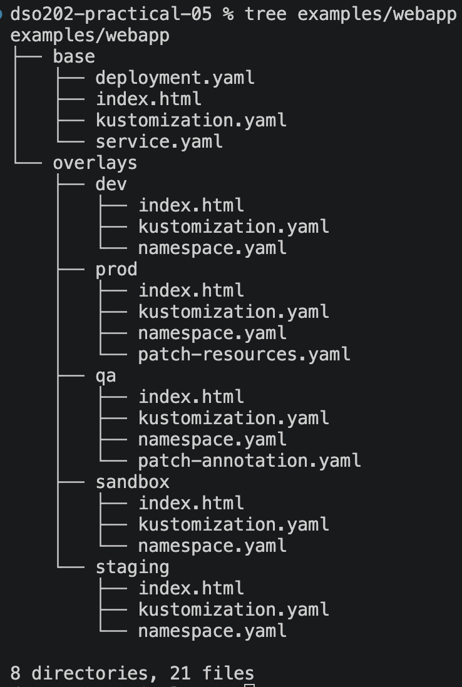

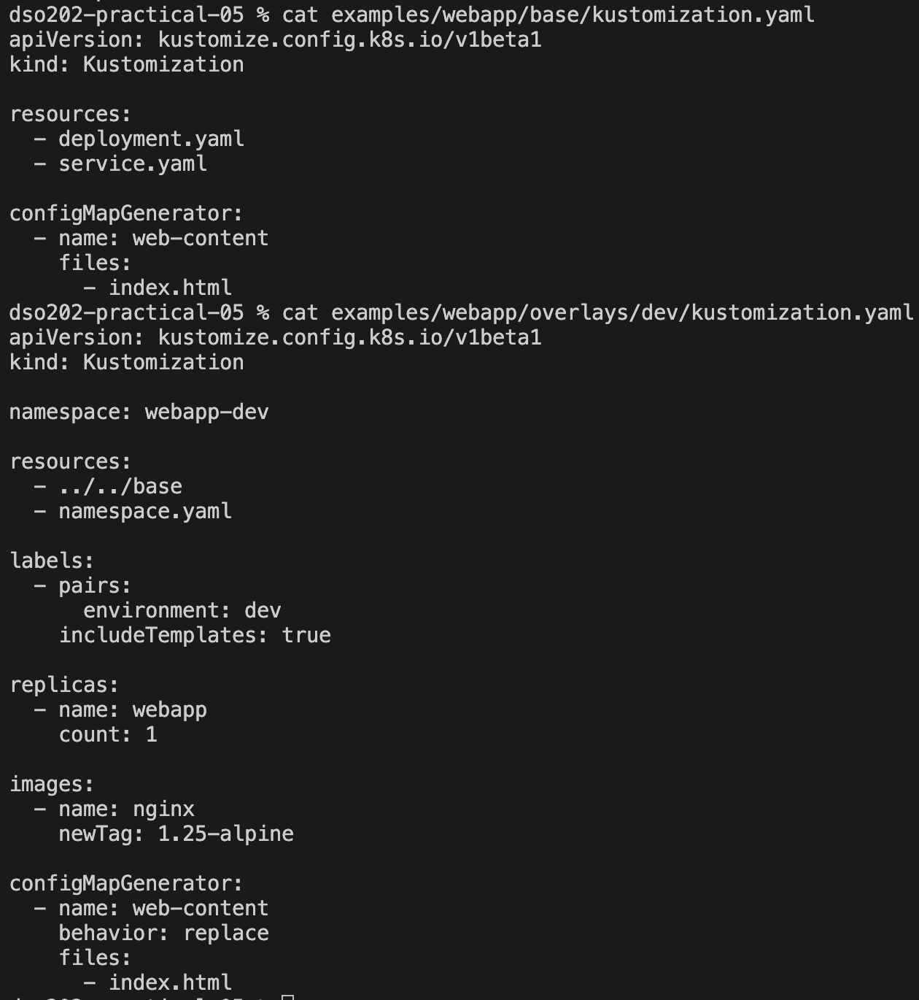


1. Which files exist only once for all environments?
**Ans:** Files that exist once for all environments are deployment.yaml, service.yaml, index.html and kustomization.yaml, all in base/.

2. Which values differ between environments?
**Ans:** The values that differ between environments are namespace, environment label, replica count, image tag, page content, and (prod only) resource limits and an annotation.

3. Where are those differences represented?
**Ans:** They are represented in each overlay's kustomization.yaml (namespace, labels, replicas, images, generator) plus its own index.html, namespace.yaml and patch file.

## Task 2: Render the base 

```
kubectl kustomize examples/webapp/base
```
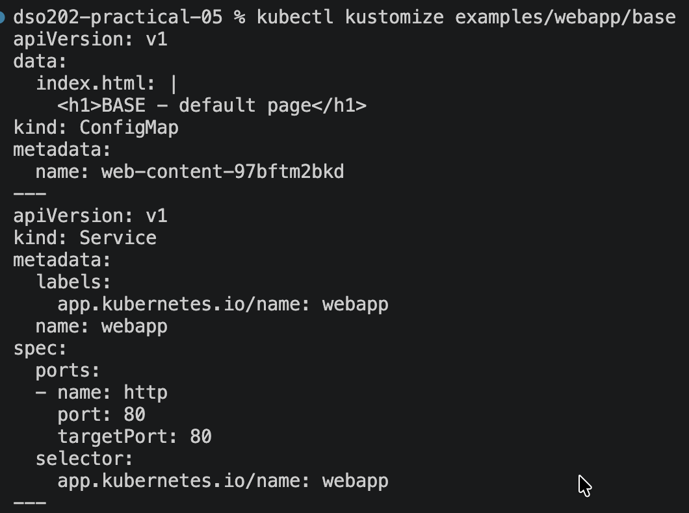


```
kubectl kustomize examples/webapp/base | grep '^kind:'
kubectl kustomize examples/webapp/base | grep 'name: web-content'
```
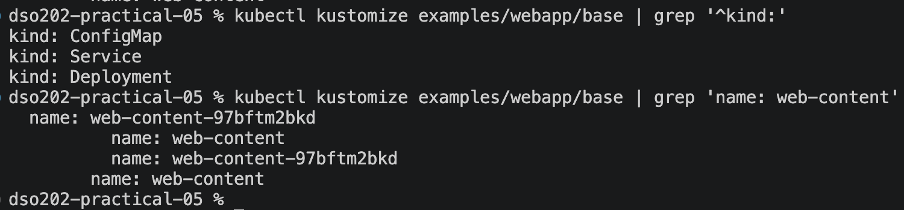

from the above command we got:

| Resource | Details |
|---|---|
| The Deployment | `kind: Deployment`, named `webapp` |
| The Service | `kind: Service`, named `webapp` |
| The generated ConfigMap | `kind: ConfigMap` with the content from `base/index.html` |
| The hash suffix | `web-content-97bftm2bkd` |
| The rewritten reference | Under `volumes:`, `configMap: name: web-content-97bftm2bkd` |


Explain why the generated ConfigMap name does not exactly equal web-content?

**Ans:** The generated ConfigMap name is `web-content-97bftm2bkd`, not `web-content`, because Kustomize's `configMapGenerator` appends a hash computed from the ConfigMap's contents. Kustomize also automatically rewrites the Deployment's `configMap.name` reference to the hashed name, so the two stay in sync. The hash exists so that a content change produces a new name, which changes the Deployment's pod template and forces a rolling update.

## Task 3: Compare dev and prod without touching the cluster
Render each to a temporary file:

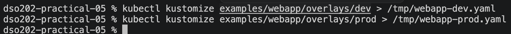

compare

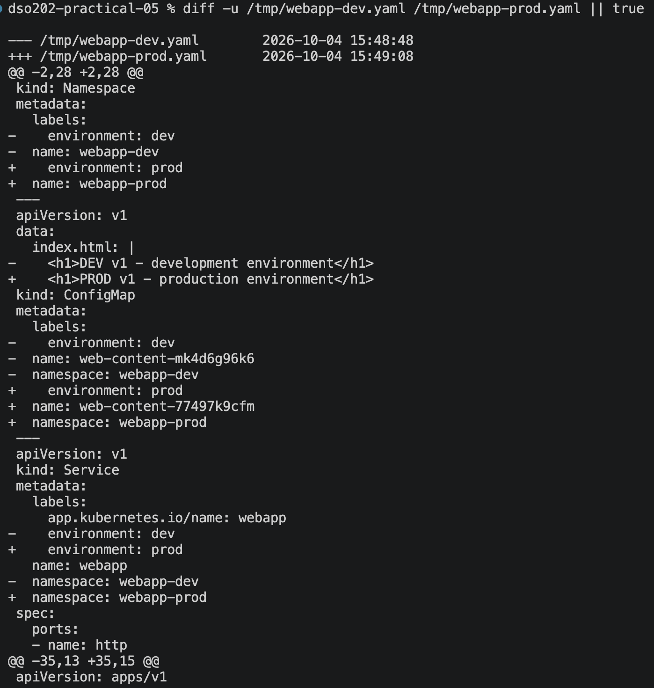

| Category | dev | prod | Where it comes from |
|---|---|---|---|
| 1 | Namespace | `webapp-dev` | `webapp-prod` | `namespace:` in the overlay |
| 2 | Environment label | `dev` | `prod` | `labels:` in the overlay |
| 3 | Replicas | 1 | 3 | `replicas:` in the overlay |
| 4 | Image tag | `nginx:1.25-alpine` | `nginx:1.27-alpine` | `images:` in the overlay |
| 5 | Resources | 50m/32Mi req, 100m/64Mi lim | 200m/128Mi req, 500m/256Mi lim | `patch-resources.yaml` |
| 6 | ConfigMap content and hash | `mk4d6g96k6` | `77497k9cfm` | `index.html` + generator |
| 7 | Annotation | none | `training.example.com/tier: production` | `patch-resources.yaml` |

The difference between dev and prod is explained by about 7 changed lines per resource, driven by a few lines in each overlay's kustomization.yaml. You don't have to read two full copies of the manifests, which is the overlay's value.

## Task 4: Deploy dev safely
First inspect:
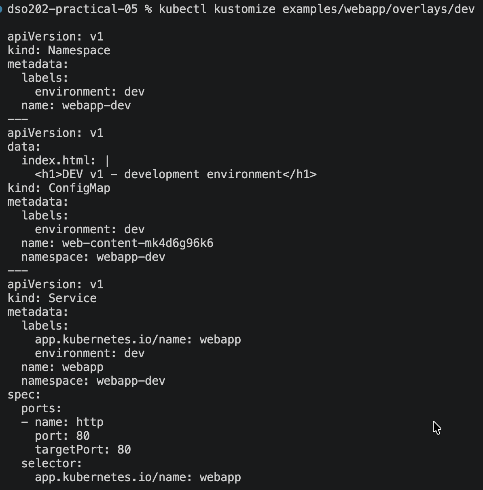

- Rendered the dev overlay without touching the cluster. The output shows the base resources transformed for dev: namespace webapp-dev, label environment: dev, 1 replica, image nginx:1.25-alpine, and the generated ConfigMap web-content-mk4d6g96k6 referenced by the Deployment.

Then diff:
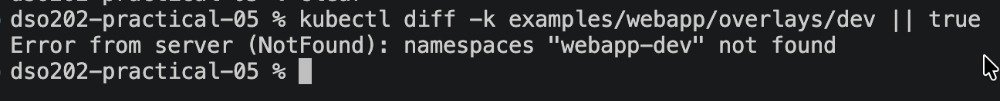

The diff returned namespaces "webapp-dev" not found. This is expected on a first deployment, since the namespace doesn't exist yet and there is nothing to compare against. The diff is read-only, so it was safe to run.

Then i applied the dev overlay. Kustomize created the Namespace, ConfigMap, Service and Deployment in one command.
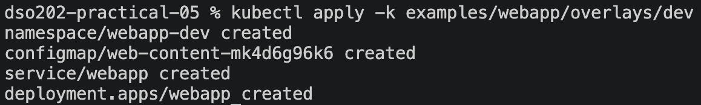

Then verify:
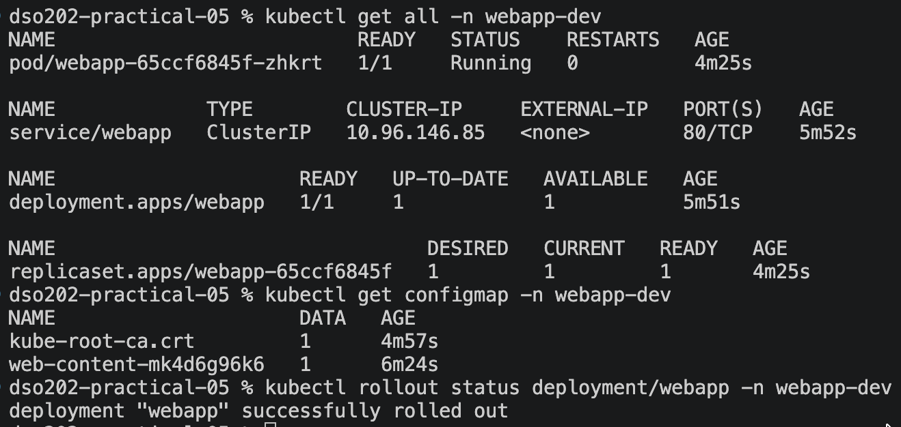
- `kubectl get all -n webapp-dev`: Shows all dev resources running in the webapp-dev namespace, including the Pod, Service, Deployment, and ReplicaSet.

- `kubectl get configmap -n webapp-dev` : Shows the generated ConfigMap containing the index.html content; the suffix changes based on its content. 

- `kubectl rollout status deployment/webapp -n webapp-dev`: Confirms that the webapp Deployment rolled out successfully and the pod is serving.

## Task 5: Reach the application
Use port-forward:
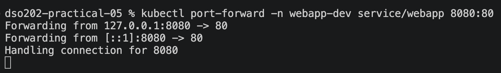

Forwarded local port 8080 to port 80 of the webapp Service in webapp-dev, so the ClusterIP service can be reached from my machine.

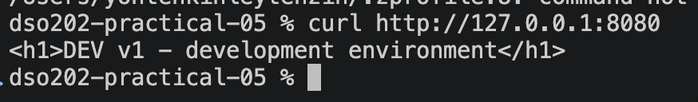
Then the response reads "DEV v1 - development environment", which is the content from overlays/dev/index.html. This confirms the dev overlay's generated ConfigMap is mounted into the NGINX pod, not the base page.

## Task 6: Prove the ConfigMap hash/rollout chain
Capture the current generated ConfigMap:


